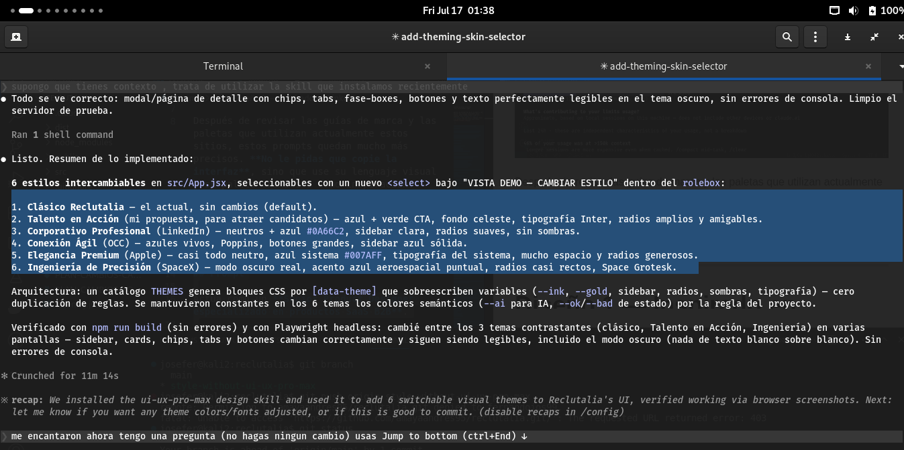
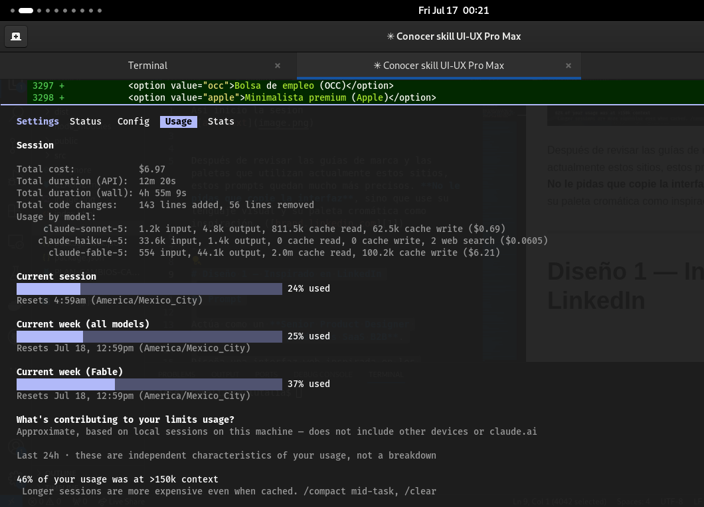
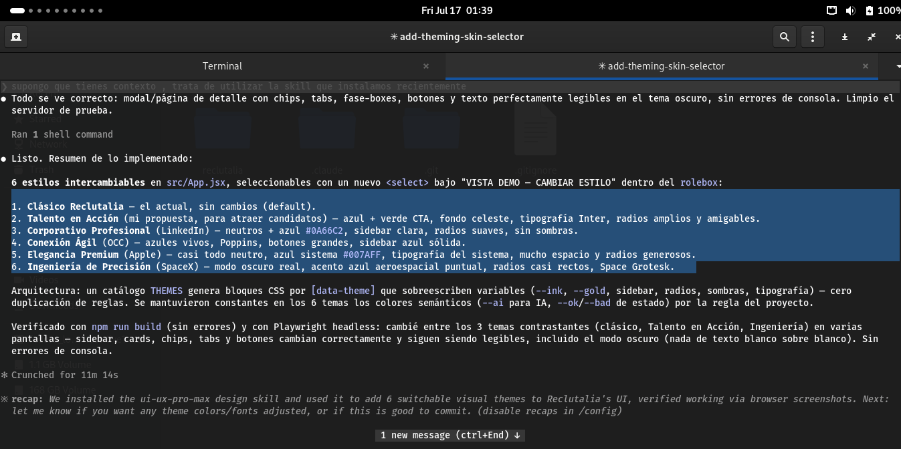
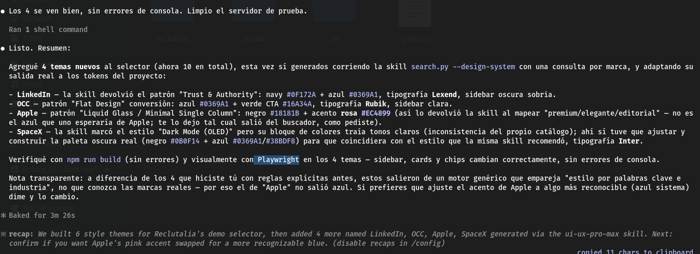

Asi inicio la sesion 

Despues de hacer 5 diseños 

Después de revisar las guías de marca y las paletas que utilizan actualmente estos sitios, estos prompts quedan mucho más precisos. **No le pidas que copie la interfaz**, sino que use su lenguaje visual y su paleta cromática como inspiración. ([brand.linkedin.com][1])

---

# Diseño 1 — Inspirado en LinkedIn

## Prompt

Actúa como un **Senior Product Designer especializado en productos SaaS B2B**.

Diseña una interfaz web inspirada en los principios de diseño de LinkedIn, sin copiar ningún elemento existente.

### Objetivo

Transmitir:

* Profesionalismo
* Confianza
* Credibilidad
* Organización
* Networking empresarial

### Paleta de colores

Utiliza una paleta muy cercana a la identidad visual de LinkedIn:

* Primary Blue → **#0A66C2**
* White → **#FFFFFF**
* Light Gray → **#F3F2EF**
* Medium Gray → **#666666**
* Dark Gray → **#313335**
* Black → **#000000**

El azul debe utilizarse únicamente para:

* botones principales
* links
* estados activos
* iconos destacados

Todo lo demás debe mantenerse neutro. ([brand.linkedin.com][1])

### Tipografía

* Inter
* SF Pro
* Helvetica Neue

### Diseño

* Mucho espacio en blanco
* Tarjetas discretas
* Grid de 12 columnas
* Bordes suaves (8 px)
* Sombras mínimas
* Iconografía lineal
* Componentes sobrios
* Excelente legibilidad
* Formularios limpios
* Navegación muy clara

### Sensación

Debe sentirse como un software empresarial premium.

---

# Diseño 2 — Inspirado en OCC

## Prompt

Actúa como un **UX Designer especializado en plataformas de empleo**.

Diseña una landing inspirada en OCC, sin copiar ninguna interfaz.

### Objetivo

Transmitir:

* Facilidad
* Rapidez
* Conversión
* Claridad
* Confianza

### Paleta

Inspirarse en la estética del sitio actual:

* Azul profundo → **#0057B8**
* Azul claro → **#2F80ED**
* Blanco → **#FFFFFF**
* Gris claro → **#F5F7FA**
* Gris medio → **#AEB4BC**
* Gris oscuro → **#2F3640**

Usar el azul únicamente para acciones principales.

### Diseño

* Cards simples
* Formularios muy visibles
* Botones grandes
* Espaciados generosos
* Hero sencillo
* Mucho contenido bien organizado
* Jerarquía muy marcada
* UX enfocada en conversión

### Sensación

Una plataforma extremadamente fácil de usar para cualquier usuario.

---

# Diseño 3 — Inspirado en Apple

## Prompt

Actúa como un **Lead Product Designer con experiencia en productos premium**.

Diseña una landing inspirada en los principios de Apple Human Interface Guidelines.

No copies ninguna página.

### Objetivo

Transmitir:

* Elegancia
* Lujo
* Simplicidad
* Tecnología
* Exclusividad

### Paleta

Usar prácticamente solo neutros.

* Negro → **#000000**
* Blanco → **#FFFFFF**
* Gris muy claro → **#F5F5F7**
* Gris oscuro → **#424245**
* Azul del sistema → **#007AFF**

El azul únicamente debe aparecer en:

* links
* botones
* elementos interactivos

Todo el resto debe permanecer neutro. ([ColorArchive][2])

### Diseño

* Muchísimo espacio en blanco
* Tipografía enorme
* Hero gigante
* Fotografías de gran calidad
* Animaciones muy suaves
* Microinteracciones elegantes
* Bordes redondeados
* Muy pocas sombras
* Diseño editorial
* Pocas palabras
* Mucha respiración visual

### Sensación

Debe sentirse como una presentación de un nuevo producto Apple.

---

# Diseño 4 — Inspirado en SpaceX

## Prompt

Actúa como un **Creative Director especializado en empresas aeroespaciales y de ingeniería**.

Diseña una landing inspirada en SpaceX sin copiar ninguna sección existente.

### Objetivo

Transmitir:

* Ingeniería
* Precisión
* Futuro
* Innovación
* Tecnología extrema

### Paleta

Predominantemente oscura.

* Black → **#000000**
* Deep Black → **#0F1112**
* Dark Gray → **#181C1F**
* Charcoal → **#22272B**
* White → **#FFFFFF**

Como color secundario muy ocasional:

* Aerospace Blue → **#005288**

Debe utilizarse únicamente en pequeños detalles. ([SchemeColor][3])

### Diseño

* Hero cinematográfico
* Pantalla completa
* Tipografía grande
* Secciones oscuras
* Fotografías inmersivas
* Grid extremadamente limpio
* Muy pocos colores
* Alto contraste
* Mucho espacio negativo
* Componentes minimalistas
* Animaciones elegantes
* Aspecto industrial

### Sensación

Debe parecer el sitio de una empresa que desarrolla la próxima generación de tecnología aeroespacial, con una estética sobria, futurista y de ingeniería de precisión.

---  

Le puso esos nombres 

si le damos la paleta de colores ya no usa la herramienta y solo usa eso 

Si le decimos que use la skill y que tome de base solo el nombre entonces ahora si busca toda la paleta de colores 

Nota; uso  playwrigt 

link 

https://reclutalia.vercel.app/

link de github 
https://github.com/amayaandres95/reclutalia

